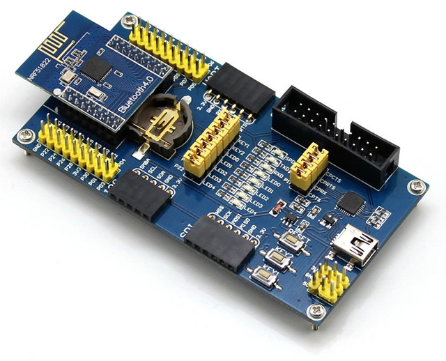

This directory contains examples for the following nRF5x development boards:

[core51822](core51822): WaveShare Bluetooth 4.0 NRF51822 Eval Kit, [website](http://www.waveshare.com/wiki/NRF51822_Eval_Kit)

[core51822/ventilation](core51822/ventilation): DIY ventilation controller based
on WaveShare Core51822 module.

