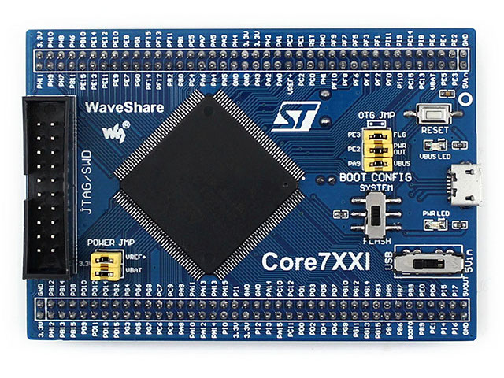
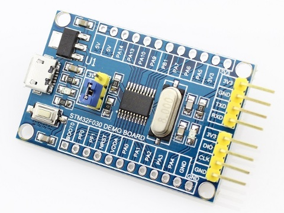
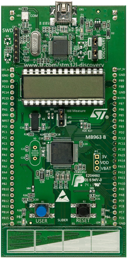
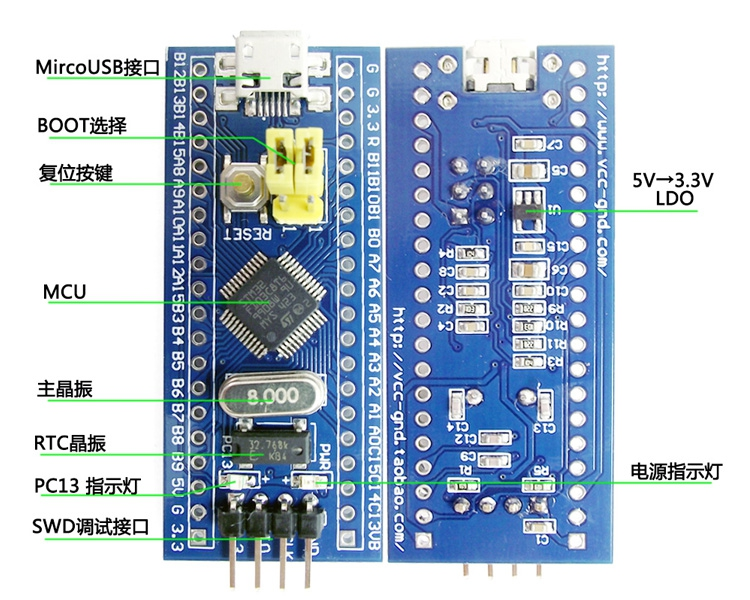
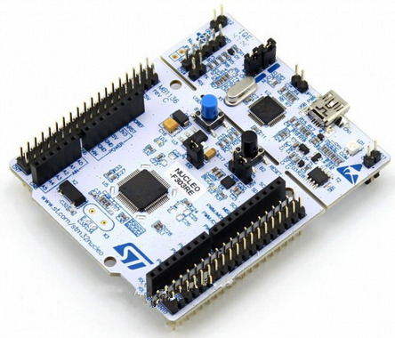
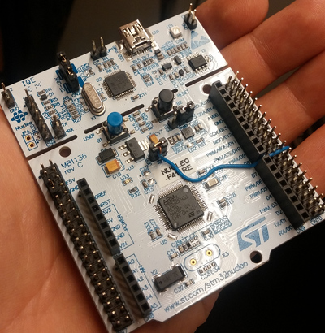
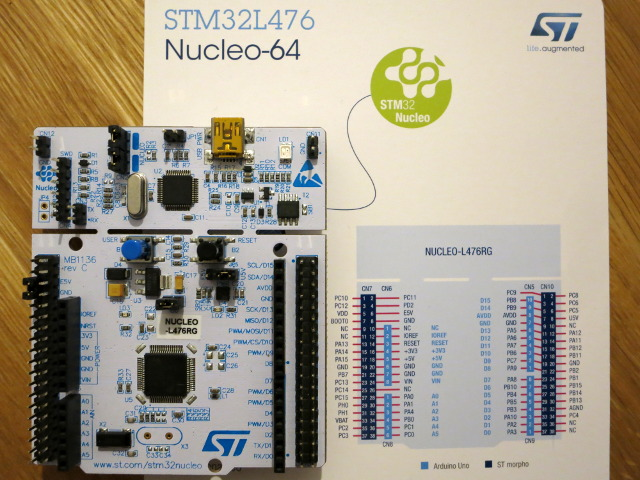
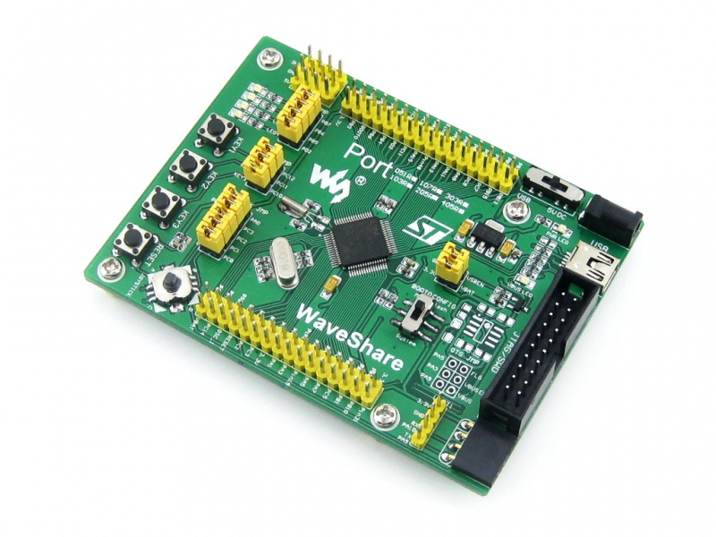

This directory contains examples for the following STM32 development boards:

[core746i](core746i): WaveShare Core746I, [website](http://www.waveshare.com/wiki/Core746I)

[f030-demo-board](f030-demo-board): STM32F030 demo board, [website](https://www.hotmcu.com/stm32f030f4p6-minimum-systerm-boardcortexm0-p-208.html?cPath=1_20)

[f4-discovery](f4-discovery): STM32F4-Discovery, [website](http://www.st.com/web/catalog/tools/FM116/SC959/SS1532/PF252419)

[l1-discovery](l1-discovery): STM32L1-Discovery, [website](http://www.st.com/web/en/catalog/tools/PF250990)

[minidev](minidev): STM32 Mini Development Board (aka "Blue Pill")

[nucleo-f303re](nucleo-f303re): NUCLEO-F303RE, [website](http://www.st.com/en/evaluation-tools/nucleo-f303re.html)

[nucleo-f411re](nucleo-f411re): NUCLEO-F411RE, [website](http://www.st.com/en/evaluation-tools/nucleo-f411re.html)

[nucleo-l476rg](nucleo-f411re): NUCLEO-L476RG, [website](http://www.st.com/en/evaluation-tools/nucleo-l476rg.html)

[port103r](port103r): WaveShare Port103R, [website](http://www.waveshare.net/wiki/Port103R)

